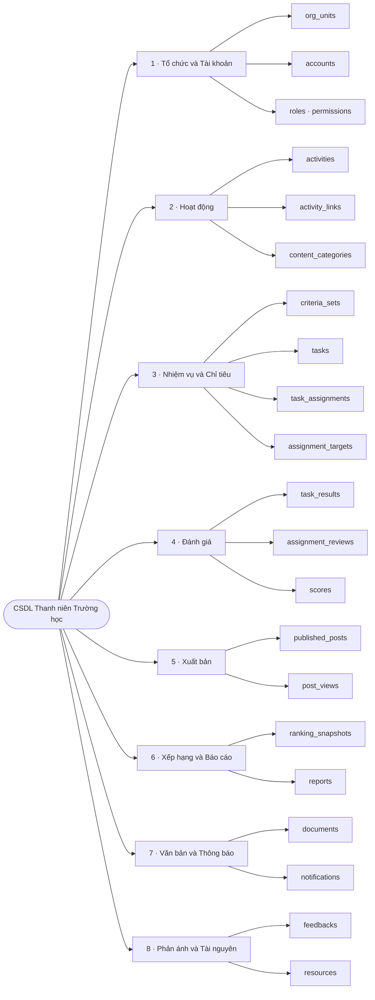
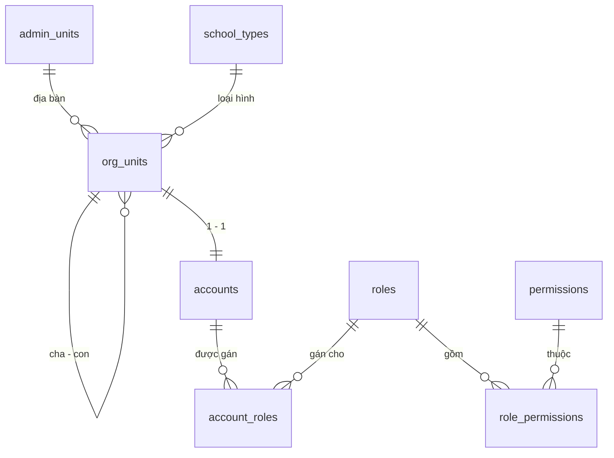
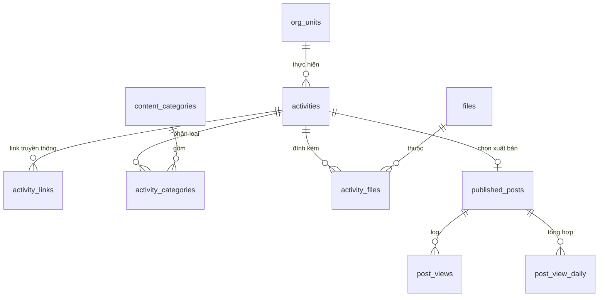
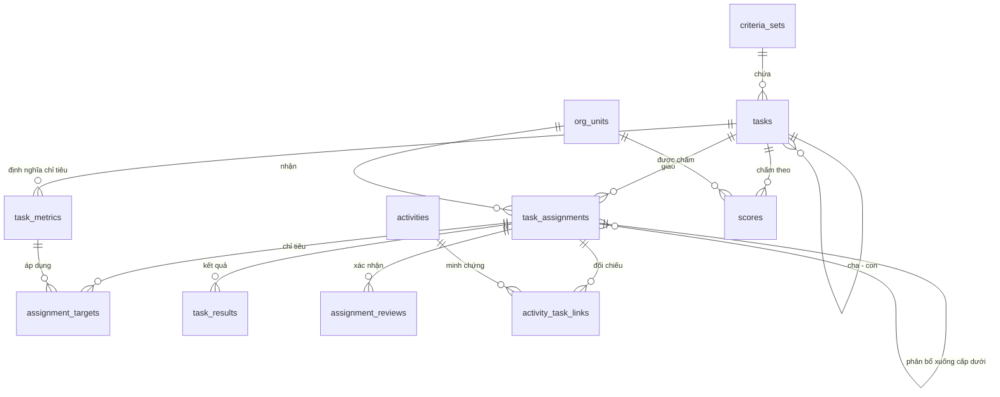
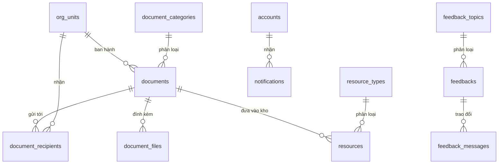
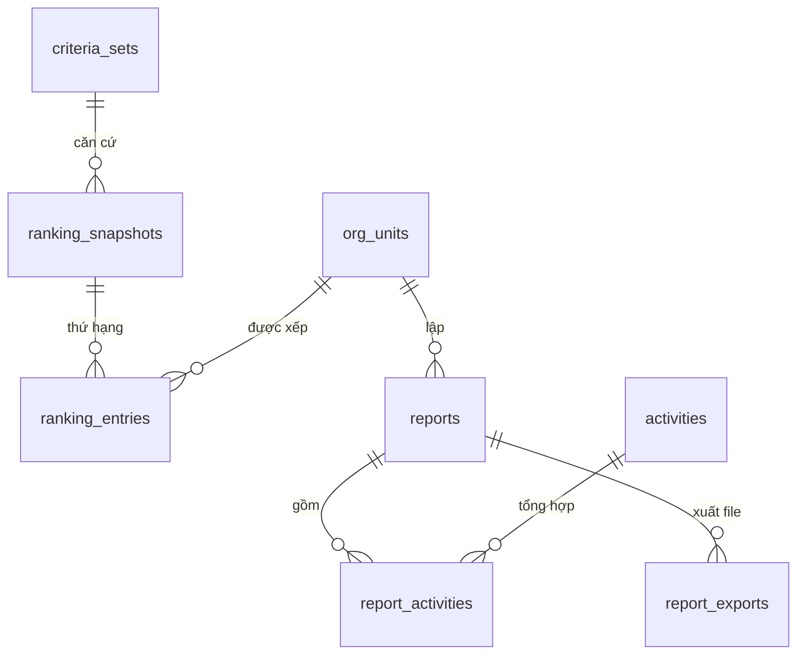

# ĐẶC TẢ CƠ SỞ DỮ LIỆU
## Website Thanh niên Trường học

| | |
|---|---|
| **Phiên bản** | 1.0 |
| **Ngày** | 07/09/2026 |
| **DBMS** | PostgreSQL 15+ |
| **Quy mô** | 43 bảng · 173 index · 78 khóa ngoại · 53 ràng buộc CHECK |
| **Chuẩn hóa** | 3NF (các điểm denormalize được đánh dấu `[D]`) |
| **Tệp DDL** | [`schema_v1.sql`](schema_v1.sql) — đã chạy thử thành công trên PostgreSQL 15 |
| **Tệp kiểm thử** | [`test_schema.sql`](test_schema.sql) — 19 kịch bản, đạt toàn bộ |

---

## 1. Quy ước

| Hạng mục | Quy ước |
|---|---|
| Tên bảng | tiếng Anh, `snake_case`, số nhiều |
| Khóa chính | `id BIGINT GENERATED ALWAYS AS IDENTITY` |
| Khóa ngoại | `<bảng_số_ít>_id` · **mọi FK đều có index** (PostgreSQL không tự tạo) |
| Thời điểm | `TIMESTAMPTZ` (lưu UTC) · ngày thuần: `DATE` |
| Tiền tệ, điểm, chỉ tiêu | `NUMERIC` — **cấm dùng `FLOAT`** (sai số làm lệch điểm thi đua) |
| Trạng thái | `VARCHAR + CHECK` (dễ mở rộng hơn `ENUM`) |
| Xóa dữ liệu | Soft delete qua `deleted_at` |
| Mốc thời gian | `created_at`, `updated_at` (trigger tự cập nhật) |

**Ký hiệu trong tài liệu:** `PK` khóa chính · `FK` khóa ngoại · `UQ` duy nhất · `NN` bắt buộc · `[D]` denormalize có chủ đích

---

## 2. Sơ đồ tư duy — 8 phân hệ



---

## 3. Danh mục bảng

### 3.1. Phân hệ Tổ chức & Tài khoản

| # | Bảng | Mô tả | Ước tính dòng |
|---|---|---|---|
| 1 | `admin_units` | Đơn vị hành chính (tỉnh → xã/phường/đặc khu) | ~3.500 |
| 2 | `org_units` | **Đơn vị Đoàn 4 cấp** — bảng gốc toàn hệ thống | ~15.000 |
| 3 | `accounts` | Tài khoản đăng nhập (1 đơn vị = 1 tài khoản) | ~15.000 |
| 4 | `roles` | Vai trò | ~10 |
| 5 | `permissions` | Quyền chi tiết | ~80 |
| 6 | `role_permissions` | Nối vai trò ↔ quyền | ~300 |
| 7 | `account_roles` | Nối tài khoản ↔ vai trò | ~20.000 |
| 8 | `school_types` | Danh mục loại hình trường | 3 |
| 9 | `files` | Kho file dùng chung toàn hệ thống | ~500.000 |

### 3.2. Phân hệ Hoạt động

| # | Bảng | Mô tả | Ước tính dòng |
|---|---|---|---|
| 10 | `activities` | **Hoạt động do đơn vị cập nhật** | ~500.000/năm |
| 11 | `activity_links` | Link bài đã đăng trên FB/website/báo | ~800.000/năm |
| 12 | `content_categories` | Danh mục nhóm nội dung | ~20 |
| 13 | `activity_categories` | Nối hoạt động ↔ nhóm nội dung (N-N) | ~1.000.000/năm |
| 14 | `activity_files` | Nối hoạt động ↔ file ảnh | ~1.500.000/năm |

### 3.3. Phân hệ Nhiệm vụ, Chỉ tiêu & Đánh giá

| # | Bảng | Mô tả | Ước tính dòng |
|---|---|---|---|
| 15 | `criteria_sets` | Bộ tiêu chí theo từng năm | ~100/năm |
| 16 | `tasks` | Nhiệm vụ / tiêu chí đánh giá | ~5.000/năm |
| 17 | `task_metrics` | Định nghĩa chỉ tiêu định lượng của nhiệm vụ | ~8.000/năm |
| 18 | `task_assignments` | **Giao nhiệm vụ cho đơn vị** (hỗ trợ phân bổ nhiều cấp) | ~200.000/năm |
| 19 | `assignment_targets` | Chỉ tiêu phân bổ cho từng lượt giao | ~300.000/năm |
| 20 | `task_results` | Lịch sử cập nhật kết quả (append-only) | ~1.000.000/năm |
| 21 | `assignment_reviews` | Lịch sử xác nhận của cấp trên | ~400.000/năm |
| 22 | `activity_task_links` | Nối hoạt động ↔ nhiệm vụ (làm minh chứng) | ~600.000/năm |
| 23 | `scores` | Kết quả chấm điểm theo tiêu chí | ~500.000/năm |

### 3.4. Phân hệ Xuất bản

| # | Bảng | Mô tả | Ước tính dòng |
|---|---|---|---|
| 24 | `published_posts` | Bài xuất bản công khai trên Website | ~5.000/năm |
| 25 | `post_views` | Log lượt xem — **phân vùng theo tháng** | ~5.000.000/năm |
| 26 | `post_view_daily` | Tổng hợp lượt xem theo ngày `[D]` | ~1.800.000/năm |

### 3.5. Phân hệ Xếp hạng & Báo cáo

| # | Bảng | Mô tả | Ước tính dòng |
|---|---|---|---|
| 27 | `ranking_snapshots` | Kỳ xếp hạng đã chốt | ~500/năm |
| 28 | `ranking_entries` | Thứ hạng từng đơn vị trong một kỳ | ~200.000/năm |
| 29 | `reports` | Báo cáo tháng/quý/năm | ~200.000/năm |
| 30 | `report_activities` | Nối báo cáo ↔ hoạt động | ~2.000.000/năm |
| 31 | `report_exports` | Lịch sử xuất file Word/PDF/Excel | ~300.000/năm |

### 3.6. Phân hệ Văn bản & Thông báo

| # | Bảng | Mô tả | Ước tính dòng |
|---|---|---|---|
| 32 | `document_categories` | Danh mục nhóm văn bản | ~15 |
| 33 | `documents` | Văn bản ban hành theo cấp | ~10.000/năm |
| 34 | `document_files` | Nối văn bản ↔ file đính kèm | ~25.000/năm |
| 35 | `document_recipients` | Nối văn bản ↔ đơn vị nhận + trạng thái đọc | ~5.000.000/năm |
| 36 | `notifications` | Thông báo hệ thống | ~3.000.000/năm |

### 3.7. Phân hệ Phản ánh

| # | Bảng | Mô tả | Ước tính dòng |
|---|---|---|---|
| 37 | `feedback_topics` | Danh mục lĩnh vực góp ý | ~10 |
| 38 | `feedbacks` | Ý kiến, góp ý, phản ánh (không cần đăng nhập) | ~20.000/năm |
| 39 | `feedback_messages` | Lịch sử trao đổi trên từng phản ánh | ~80.000/năm |

### 3.8. Phân hệ Tài nguyên & Hệ thống

| # | Bảng | Mô tả | Ước tính dòng |
|---|---|---|---|
| 40 | `resource_types` | Danh mục loại tài nguyên | 3 |
| 41 | `resources` | Kho tài liệu, biểu mẫu, sản phẩm truyền thông | ~5.000 |
| 42 | `audit_logs` | Nhật ký thao tác — **phân vùng theo tháng** | ~2.000.000/năm |
| 43 | `system_settings` | Cấu hình hệ thống (gồm link Học sinh 3 tốt) | ~50 |

---

## 4. Sơ đồ quan hệ

### 4.1. Tổ chức & Tài khoản



### 4.2. Hoạt động & Xuất bản



### 4.3. Nhiệm vụ, Chỉ tiêu & Đánh giá



### 4.4. Văn bản, Thông báo, Phản ánh & Tài nguyên



### 4.5. Xếp hạng & Báo cáo



---

## 5. Từ điển dữ liệu

> Các cột `created_at`, `updated_at` (`TIMESTAMPTZ NN DEFAULT now()`) và `deleted_at` (`TIMESTAMPTZ NULL`) xuất hiện ở hầu hết bảng nghiệp vụ — không lặp lại trong đặc tả dưới đây.

### 5.1. `org_units` — Đơn vị Đoàn

| Cột | Kiểu | Ràng buộc | Mô tả |
|---|---|---|---|
| `id` | BIGINT | PK | |
| `parent_id` | BIGINT | FK→`org_units` | Đơn vị cấp trên trực tiếp |
| `code` | VARCHAR(50) | NN, UQ | Mã đơn vị, dùng khi import Excel |
| `name` | VARCHAR(255) | NN | Tên đầy đủ |
| `short_name` | VARCHAR(100) | | Tên viết tắt |
| `org_level` | SMALLINT | NN, CK 1–4 | 1=TW · 2=Tỉnh,Thành · 3=Phường,Xã,Đặc khu · 4=Cơ sở |
| `path` | VARCHAR(255) | NN `[D]` | Materialized path `/1/12/345/` — trigger tự sinh |
| `depth` | SMALLINT | NN `[D]` | Độ sâu trong cây |
| `admin_unit_id` | BIGINT | FK→`admin_units` | Địa bàn |
| `school_type_id` | BIGINT | FK→`school_types` | Chỉ áp dụng cấp 4 |
| `address` | VARCHAR(255) | | |
| `is_active` | BOOLEAN | NN, mặc định TRUE | |

**Ràng buộc nghiệp vụ:** cấp 1 bắt buộc `parent_id IS NULL`, cấp 2–4 bắt buộc có cha · `school_type_id` chỉ được gán khi `org_level = 4`.

---

### 5.2. `accounts` — Tài khoản

| Cột | Kiểu | Ràng buộc | Mô tả |
|---|---|---|---|
| `id` | BIGINT | PK | |
| `org_unit_id` | BIGINT | NN, **UQ**, FK→`org_units` | **UQ thực thi quy tắc 1 đơn vị = 1 tài khoản** |
| `username` | CITEXT | NN, UQ | Không phân biệt hoa/thường |
| `email` | CITEXT | NN, UQ | Nhận thông báo, khôi phục mật khẩu |
| `phone` | VARCHAR(20) | | |
| `password_hash` | VARCHAR(255) | NN | bcrypt / argon2id |
| `contact_person` | VARCHAR(150) | | Cán bộ phụ trách tài khoản |
| `contact_position` | VARCHAR(150) | | Chức vụ |
| `status` | VARCHAR(20) | NN, CK | `PENDING` · `ACTIVE` · `LOCKED` · `DISABLED` |
| `must_change_password` | BOOLEAN | NN, mặc định TRUE | |
| `last_login_at` | TIMESTAMPTZ | | |
| `password_changed_at` | TIMESTAMPTZ | | |
| `failed_login_count` | SMALLINT | NN, mặc định 0 | Khóa tài khoản khi sai nhiều lần |
| `locked_until` | TIMESTAMPTZ | | |

---

### 5.3. `activities` — Hoạt động

| Cột | Kiểu | Ràng buộc | Mô tả |
|---|---|---|---|
| `id` | BIGINT | PK | |
| `org_unit_id` | BIGINT | NN, FK→`org_units` | Đơn vị thực hiện — tự lấy từ tài khoản |
| `title` | VARCHAR(255) | NN | |
| `summary` | TEXT | CK ≤ 2000 ký tự | Tóm tắt, giới hạn dưới 250 từ |
| `start_date` | DATE | NN | |
| `end_date` | DATE | CK ≥ `start_date` | |
| `location` | VARCHAR(255) | | |
| `participant_count` | INTEGER | | *(đề xuất bổ sung)* Số đoàn viên tham gia |
| `activity_type` | VARCHAR(20) | NN, CK | `TASK_BASED` (thực hiện nhiệm vụ) · `GENERAL` (nhóm nội dung chung) |
| `status` | VARCHAR(20) | NN, CK | `DRAFT` nháp · `SUBMITTED` đã cập nhật · `REVISED` đã điều chỉnh |
| `confirm_status` | VARCHAR(20) | NN, CK | `NOT_REQUIRED` · `PENDING` · `CONFIRMED` · `NEEDS_INFO` · `REJECTED` |
| `created_by_account_id` | BIGINT | NN, FK→`accounts` | |
| `updated_by_account_id` | BIGINT | FK→`accounts` | |
| `search_vector` | TSVECTOR | generated `[D]` | Tìm kiếm không dấu, PostgreSQL tự sinh |

**Khóa phụ:** `UQ (id, org_unit_id)` — phục vụ khóa ngoại phức hợp tại `activity_task_links`.

---

### 5.4. `activity_links` — Link truyền thông

| Cột | Kiểu | Ràng buộc | Mô tả |
|---|---|---|---|
| `id` | BIGINT | PK | |
| `activity_id` | BIGINT | NN, FK→`activities` CASCADE | |
| `platform` | VARCHAR(30) | NN, CK | `FACEBOOK` · `WEBSITE` · `ZALO` · `TIKTOK` · `YOUTUBE` · `PRESS` · `OTHER` |
| `url` | TEXT | NN, CK bắt đầu `http(s)://` | |
| `note` | VARCHAR(255) | | |

---

### 5.5. `criteria_sets` — Bộ tiêu chí theo năm

| Cột | Kiểu | Ràng buộc | Mô tả |
|---|---|---|---|
| `id` | BIGINT | PK | |
| `code` | VARCHAR(50) | NN | |
| `name` | VARCHAR(255) | NN | |
| `year` | SMALLINT | NN, CK 2020–2100 | Mỗi năm quản lý độc lập |
| `owner_org_unit_id` | BIGINT | NN, FK→`org_units` | Đơn vị ban hành |
| `target_org_level` | SMALLINT | | Áp dụng cho cấp nào |
| `total_points` | NUMERIC(7,2) | | Tổng điểm tối đa |
| `effective_from` / `effective_to` | DATE | | |
| `status` | VARCHAR(20) | NN, CK | `DRAFT` · `ACTIVE` · `CLOSED` · `ARCHIVED` |

**UQ** `(owner_org_unit_id, year, code)`

---

### 5.6. `tasks` — Nhiệm vụ / Tiêu chí

| Cột | Kiểu | Ràng buộc | Mô tả |
|---|---|---|---|
| `id` | BIGINT | PK | |
| `criteria_set_id` | BIGINT | FK→`criteria_sets` | NULL = nhiệm vụ giao đột xuất |
| `parent_task_id` | BIGINT | FK→`tasks` | Cấu trúc phân cấp I → I.1 → I.1.a |
| `code` | VARCHAR(50) | | Mã hiệu tiêu chí |
| `title` | VARCHAR(500) | NN | |
| `description` | TEXT | | |
| `task_kind` | VARCHAR(20) | NN, CK | `TASK` nhiệm vụ · `CRITERION` tiêu chí |
| `max_points` | NUMERIC(6,2) | CK ≥ 0 | Điểm tối đa |
| `requirement` | TEXT | | Yêu cầu thực hiện |
| `tracking_method` | TEXT | | Phương thức theo dõi |
| `scoring_method` | VARCHAR(30) | NN, CK | `AUTO_AGGREGATE` · `MANUAL_CONFIRM` · `EXPERT_REVIEW` · `OTHER` |
| `due_date` | DATE | | Thời hạn thực hiện |
| `created_by_org_unit_id` | BIGINT | NN, FK→`org_units` | Đơn vị xây dựng |
| `responsible_dept` | VARCHAR(255) | | Bộ phận phụ trách |
| `target_org_level` | SMALLINT | | Đối tượng thực hiện |
| `display_order` | SMALLINT | NN, mặc định 0 | |
| `status` | VARCHAR(20) | NN, CK | `DRAFT` · `PUBLISHED` · `CLOSED` |

---

### 5.7. `task_metrics` — Định nghĩa chỉ tiêu

| Cột | Kiểu | Ràng buộc | Mô tả |
|---|---|---|---|
| `id` | BIGINT | PK | |
| `task_id` | BIGINT | NN, FK→`tasks` CASCADE | |
| `code` | VARCHAR(50) | NN | |
| `name` | VARCHAR(255) | NN | VD: "Số hoạt động tổ chức" |
| `unit_of_measure` | VARCHAR(50) | NN | VD: "hoạt động", "người", "%" |
| `aggregation_type` | VARCHAR(20) | NN, CK | `SUM` · `COUNT` · `AVG` · `MAX` · `PERCENT` |
| `display_order` | SMALLINT | NN, mặc định 0 | |

**UQ** `(task_id, code)`

---

### 5.8. `task_assignments` — Giao nhiệm vụ

| Cột | Kiểu | Ràng buộc | Mô tả |
|---|---|---|---|
| `id` | BIGINT | PK | |
| `task_id` | BIGINT | NN, FK→`tasks` CASCADE | |
| `org_unit_id` | BIGINT | NN, FK→`org_units` | Đơn vị **nhận** |
| `assigned_by_org_unit_id` | BIGINT | NN, FK→`org_units` | Đơn vị **giao** |
| `parent_assignment_id` | BIGINT | FK→`task_assignments` | **Lượt giao ở cấp trên** — dùng cho phân bổ chỉ tiêu nhiều cấp |
| `due_date` | DATE | | Hạn riêng, có thể sớm hơn hạn gốc |
| `progress_status` | VARCHAR(20) | NN, CK | `NOT_STARTED` · `IN_PROGRESS` · `COMPLETED` · `OVERDUE` |
| `confirm_status` | VARCHAR(20) | NN, CK | `PENDING` · `CONFIRMED` · `NEEDS_INFO` · `REJECTED` |
| `completion_rate` | NUMERIC(5,2) | NN `[D]` | % hoàn thành, tính lại khi có kết quả mới |
| `completed_at` | TIMESTAMPTZ | | |
| `confirmed_at` | TIMESTAMPTZ | | |
| `confirmed_by_account_id` | BIGINT | FK→`accounts` | |
| `note` | TEXT | | |
| `assigned_at` | TIMESTAMPTZ | NN | |

**UQ** `(task_id, org_unit_id)` — mỗi nhiệm vụ giao cho một đơn vị đúng 1 lần · **UQ** `(id, org_unit_id)` phục vụ FK phức hợp.

---

### 5.9. `assignment_targets` — Chỉ tiêu phân bổ

| Cột | Kiểu | Ràng buộc | Mô tả |
|---|---|---|---|
| `id` | BIGINT | PK | |
| `task_assignment_id` | BIGINT | NN, FK→`task_assignments` CASCADE | |
| `task_metric_id` | BIGINT | NN, FK→`task_metrics` | |
| `target_value` | NUMERIC(14,2) | NN, CK ≥ 0 | Chỉ tiêu được giao |
| `achieved_value` | NUMERIC(14,2) | NN `[D]` | Kết quả hiện tại |

**UQ** `(task_assignment_id, task_metric_id)`

---

### 5.10. `task_results` — Lịch sử kết quả *(append-only)*

| Cột | Kiểu | Ràng buộc | Mô tả |
|---|---|---|---|
| `id` | BIGINT | PK | |
| `task_assignment_id` | BIGINT | NN, FK→`task_assignments` CASCADE | |
| `assignment_target_id` | BIGINT | FK→`assignment_targets` | NULL khi nhiệm vụ không có chỉ tiêu số |
| `reported_value` | NUMERIC(14,2) | | |
| `report_note` | TEXT | | |
| `data_source` | VARCHAR(20) | NN, CK | `MANUAL` · `AUTO_AGGREGATE` |
| `reported_by_account_id` | BIGINT | NN, FK→`accounts` | |
| `reported_at` | TIMESTAMPTZ | NN | |

---

### 5.11. `assignment_reviews` — Nhật ký xác nhận

| Cột | Kiểu | Ràng buộc | Mô tả |
|---|---|---|---|
| `id` | BIGINT | PK | |
| `task_assignment_id` | BIGINT | NN, FK→`task_assignments` CASCADE | |
| `reviewer_account_id` | BIGINT | NN, FK→`accounts` | |
| `action` | VARCHAR(20) | NN, CK | `CONFIRM` · `REQUEST_INFO` · `REJECT` |
| `note` | TEXT | | Lý do trả lại |
| `reviewed_at` | TIMESTAMPTZ | NN | |

---

### 5.12. `scores` — Chấm điểm

| Cột | Kiểu | Ràng buộc | Mô tả |
|---|---|---|---|
| `id` | BIGINT | PK | |
| `criteria_set_id` | BIGINT | NN, FK→`criteria_sets` | |
| `task_id` | BIGINT | NN, FK→`tasks` | |
| `org_unit_id` | BIGINT | NN, FK→`org_units` | Đơn vị được chấm |
| `points` | NUMERIC(6,2) | NN, CK 0 ≤ `points` ≤ `max_points` | |
| `max_points` | NUMERIC(6,2) | NN | Chép lại tại thời điểm chấm để giữ nguyên kết quả lịch sử |
| `scoring_method` | VARCHAR(30) | NN | |
| `note` | TEXT | | |
| `scored_by_account_id` | BIGINT | FK→`accounts` | NULL = hệ thống tự chấm |
| `scored_at` | TIMESTAMPTZ | NN | |

**UQ** `(criteria_set_id, task_id, org_unit_id)`

---

### 5.13. `published_posts` — Bài xuất bản

| Cột | Kiểu | Ràng buộc | Mô tả |
|---|---|---|---|
| `id` | BIGINT | PK | |
| `activity_id` | BIGINT | FK→`activities`, UQ có điều kiện | NULL = bài do biên tập viên tự viết |
| `slug` | VARCHAR(255) | NN, UQ | Đường dẫn thân thiện SEO |
| `title` | VARCHAR(255) | NN | |
| `excerpt` | VARCHAR(500) | | |
| `content` | TEXT | | Nội dung đã biên tập lại |
| `cover_file_id` | BIGINT | FK→`files` | Ảnh bìa |
| `status` | VARCHAR(20) | NN, CK | `DRAFT` · `SCHEDULED` · `PUBLISHED` · `UNPUBLISHED` |
| `is_featured` | BOOLEAN | NN | Bài nổi bật |
| `published_at` | TIMESTAMPTZ | CK bắt buộc khi `PUBLISHED` | |
| `unpublished_at` | TIMESTAMPTZ | | |
| `view_count` | BIGINT | NN `[D]` | Bộ đếm nhanh |
| `meta_title` / `meta_description` | VARCHAR | | Thẻ SEO |
| `editor_account_id` | BIGINT | NN, FK→`accounts` | |

---

### 5.14. `post_views` — Log lượt xem *(phân vùng theo tháng)*

| Cột | Kiểu | Ràng buộc | Mô tả |
|---|---|---|---|
| `id` | BIGINT | PK `(id, viewed_at)` | Dùng sequence tường minh |
| `post_id` | BIGINT | NN | **Cố ý không đặt FK** để không làm chậm ghi log |
| `viewed_at` | TIMESTAMPTZ | NN, khóa phân vùng | |
| `visitor_hash` | CHAR(64) | | Hash(IP + user agent) — không lưu IP thô |
| `referrer` | VARCHAR(500) | | |
| `device_type` | VARCHAR(20) | | `DESKTOP` · `MOBILE` · `TABLET` |

**`post_view_daily`** `(post_id, view_date)` PK · `view_count`, `unique_visitors` — job đêm dồn dữ liệu, báo cáo chỉ đọc bảng này.

---

### 5.15. `ranking_snapshots` / `ranking_entries` — Xếp hạng

**`ranking_snapshots`** — mỗi lần chốt sổ tạo 1 bản ghi

| Cột | Kiểu | Ràng buộc | Mô tả |
|---|---|---|---|
| `id` | BIGINT | PK | |
| `name` | VARCHAR(255) | NN | |
| `criteria_set_id` | BIGINT | FK→`criteria_sets` | |
| `scope_org_unit_id` | BIGINT | NN, FK→`org_units` | Phạm vi xếp hạng |
| `ranked_org_level` | SMALLINT | NN | Xếp hạng đơn vị thuộc cấp nào |
| `ranking_type` | VARCHAR(30) | NN, CK | `BY_SCORE` · `BY_TASK_RESULT` · `BY_ACTIVITY_COUNT` |
| `period_type` | VARCHAR(20) | NN, CK | `MONTH` · `QUARTER` · `YEAR` · `CUSTOM` |
| `period_start` / `period_end` | DATE | NN, CK end ≥ start | |
| `total_units` | INTEGER | NN | |
| `generated_by_account_id` | BIGINT | NN, FK→`accounts` | |

**`ranking_entries`** — `snapshot_id` FK CASCADE · `org_unit_id` FK · `rank_position` INTEGER NN · `total_score` NUMERIC(8,2) · `completion_rate` NUMERIC(5,2) · `completed_tasks` / `total_tasks` / `activity_count` INTEGER · `extra_metrics` JSONB · **UQ** `(snapshot_id, org_unit_id)`

---

### 5.16. `reports` — Báo cáo

| Cột | Kiểu | Ràng buộc | Mô tả |
|---|---|---|---|
| `id` | BIGINT | PK | |
| `org_unit_id` | BIGINT | NN, FK→`org_units` | |
| `title` | VARCHAR(255) | NN | |
| `report_type` | VARCHAR(20) | NN, CK | `MONTHLY` · `QUARTERLY` · `ANNUAL` · `CUSTOM` |
| `period_year` | SMALLINT | NN | |
| `period_number` | SMALLINT | CK theo loại | Tháng 1–12 hoặc quý 1–4, bắt buộc khi tương ứng |
| `period_start` / `period_end` | DATE | NN, CK end ≥ start | |
| `content` | TEXT | | Nội dung cuối sau khi người dùng sửa |
| `ai_draft_content` | TEXT | | Bản nháp AI, giữ lại để đối chiếu |
| `ai_model` | VARCHAR(100) | | |
| `ai_generated_at` | TIMESTAMPTZ | | |
| `status` | VARCHAR(20) | NN, CK | `DRAFT` · `FINALIZED` |
| `created_by_account_id` | BIGINT | NN, FK→`accounts` | |
| `finalized_at` | TIMESTAMPTZ | | |

**`report_exports`** — `report_id` FK CASCADE · `file_id` FK · `export_format` CK `DOCX`/`PDF`/`XLSX` · `exported_by_account_id` FK · `exported_at`

---

### 5.17. `documents` — Văn bản

| Cột | Kiểu | Ràng buộc | Mô tả |
|---|---|---|---|
| `id` | BIGINT | PK | |
| `doc_number` | VARCHAR(100) | | Số hiệu văn bản |
| `title` | VARCHAR(500) | NN | |
| `summary` | TEXT | | Trích yếu |
| `document_category_id` | BIGINT | FK→`document_categories` | |
| `issuing_org_unit_id` | BIGINT | NN, FK→`org_units` | Cơ quan ban hành |
| `issued_date` | DATE | NN | |
| `effective_date` | DATE | | |
| `recipient_scope` | VARCHAR(20) | NN, CK | `ALL_DESCENDANTS` · `DIRECT_CHILDREN` · `SELECTED` |
| `status` | VARCHAR(20) | NN, CK | `DRAFT` · `ISSUED` · `REVOKED` |
| `created_by_account_id` | BIGINT | NN, FK→`accounts` | |

**`document_recipients`** — PK `(document_id, org_unit_id)` · `read_at` TIMESTAMPTZ NULL (NULL = chưa đọc)

---

### 5.18. `notifications` — Thông báo

| Cột | Kiểu | Ràng buộc | Mô tả |
|---|---|---|---|
| `id` | BIGINT | PK | |
| `recipient_account_id` | BIGINT | NN, FK→`accounts` CASCADE | |
| `notification_type` | VARCHAR(40) | NN, CK | `TASK_ASSIGNED` · `TASK_DUE_SOON` · `TASK_OVERDUE` · `RESULT_CONFIRMED` · `RESULT_NEEDS_INFO` · `NEW_DOCUMENT` · `FEEDBACK_REPLIED` · `FEEDBACK_STATUS` · `POST_PUBLISHED` · `SYSTEM` |
| `title` | VARCHAR(255) | NN | |
| `message` | TEXT | | |
| `ref_type` / `ref_id` | VARCHAR(50) / BIGINT | | Tham chiếu mềm tới đối tượng liên quan |
| `link_url` | VARCHAR(500) | | |
| `channel` | VARCHAR(10) | NN, CK | `WEB` · `EMAIL` · `BOTH` |
| `is_read` | BOOLEAN | NN | |
| `read_at` | TIMESTAMPTZ | | |
| `email_status` | VARCHAR(20) | CK | `PENDING` · `SENT` · `FAILED` |
| `email_sent_at` | TIMESTAMPTZ | | |
| `dedupe_key` | VARCHAR(200) | **UQ** | Chống gửi trùng, VD `TASK_DUE:1234:D7` |

---

### 5.19. `feedbacks` — Ý kiến, phản ánh

| Cột | Kiểu | Ràng buộc | Mô tả |
|---|---|---|---|
| `id` | BIGINT | PK | |
| `tracking_code` | VARCHAR(20) | NN, UQ | Mã tra cứu, VD `PA-2026-000123` |
| `access_token` | VARCHAR(64) | NN | Chuỗi bí mật trong link, chống dò mã |
| `sender_name` | VARCHAR(150) | NN | |
| `sender_email` | CITEXT | NN, CK định dạng | Kênh nhận kết quả |
| `sender_phone` | VARCHAR(20) | | |
| `sender_org_text` | VARCHAR(255) | | Trường/đơn vị người gửi tự nhập |
| `sender_admin_unit_id` | BIGINT | FK→`admin_units` | Địa bàn chọn từ danh mục |
| `feedback_topic_id` | BIGINT | FK→`feedback_topics` | |
| `title` | VARCHAR(255) | NN | |
| `content` | TEXT | NN | |
| `status` | VARCHAR(20) | NN, CK | `NEW` chưa phản hồi · `IN_PROGRESS` · `RESOLVED` · `CLOSED` |
| `assigned_account_id` | BIGINT | FK→`accounts` | Cán bộ TW tiếp nhận |
| `ip_address` | INET | | Chống spam |
| `user_agent` | VARCHAR(500) | | |
| `is_spam` | BOOLEAN | NN | |
| `submitted_at` / `first_responded_at` / `resolved_at` / `closed_at` | TIMESTAMPTZ | | Mốc xử lý |

**`feedback_messages`** — `feedback_id` FK CASCADE · `sender_type` CK `CITIZEN`/`STAFF` · `sender_account_id` FK · `content` TEXT NN · `is_internal_note` BOOLEAN
*Ràng buộc:* `STAFF` bắt buộc có tài khoản, `CITIZEN` bắt buộc không · ghi chú nội bộ chỉ `STAFF` được tạo.

---

### 5.20. `resources` — Kho tài nguyên

| Cột | Kiểu | Ràng buộc | Mô tả |
|---|---|---|---|
| `id` | BIGINT | PK | |
| `resource_type_id` | BIGINT | NN, FK→`resource_types` | |
| `title` | VARCHAR(255) | NN | |
| `description` | TEXT | | |
| `file_id` | BIGINT | NN, FK→`files` | |
| `thumbnail_file_id` | BIGINT | FK→`files` | |
| `source_document_id` | BIGINT | FK→`documents` | Đưa văn bản đã ban hành vào kho công khai |
| `is_public` | BOOLEAN | NN | FALSE = chỉ tài khoản nội bộ tải được |
| `download_count` | INTEGER | NN `[D]` | |
| `published_by_org_unit_id` | BIGINT | NN, FK→`org_units` | |
| `published_at` | TIMESTAMPTZ | | |
| `status` | VARCHAR(20) | NN, CK | `DRAFT` · `PUBLISHED` · `ARCHIVED` |

---

### 5.21. Bảng danh mục *(dùng chung một khuôn)*

`school_types` · `content_categories` · `document_categories` · `resource_types` · `feedback_topics`

| Cột | Kiểu | Ràng buộc |
|---|---|---|
| `id` | BIGINT | PK |
| `code` | VARCHAR(30–50) | NN, UQ |
| `name` | VARCHAR(150–200) | NN |
| `display_order` | SMALLINT | NN, mặc định 0 |
| `is_active` | BOOLEAN | NN, mặc định TRUE |

Riêng `content_categories` có thêm `parent_id` (FK tự tham chiếu) và `description`.

---

### 5.22. Bảng nối *(N-N)*

| Bảng | Khóa chính | Cột bổ sung |
|---|---|---|
| `activity_categories` | `(activity_id, content_category_id)` | — |
| `activity_files` | `(activity_id, file_id)` | `display_order`, `is_cover` |
| `activity_task_links` | `(activity_id, task_assignment_id)` | `org_unit_id` — cột cầu nối cho FK phức hợp |
| `report_activities` | `(report_id, activity_id)` | `display_order`, `is_highlighted` |
| `document_files` | `(document_id, file_id)` | `display_order` |
| `document_recipients` | `(document_id, org_unit_id)` | `read_at` |
| `role_permissions` | `(role_id, permission_id)` | — |
| `account_roles` | `(account_id, role_id)` | `granted_at`, `granted_by_account_id` |

---

### 5.23. Bảng hệ thống

**`files`** — `storage_path` VARCHAR(500) NN · `original_name` NN · `mime_type` NN · `size_bytes` BIGINT NN CK > 0 · `checksum_sha256` CHAR(64) · `uploaded_by_account_id` FK

**`audit_logs`** *(phân vùng theo tháng)* — `account_id` FK (NULL = hệ thống) · `action` · `entity_type` · `entity_id` · `old_values` JSONB · `new_values` JSONB · `ip_address` INET · `user_agent` · PK `(id, created_at)`

**`system_settings`** — `setting_key` VARCHAR(100) PK · `value` TEXT · `value_type` CK `STRING`/`NUMBER`/`BOOLEAN`/`JSON` · `group_name` · `description`

**`admin_units`** — `code` UQ · `name` NN · `unit_type` CK `PROVINCE`/`WARD`/`COMMUNE`/`SPECIAL_ZONE` · `parent_id` FK tự tham chiếu

---

## 6. Index trọng yếu

| Bảng | Index | Mục đích |
|---|---|---|
| `org_units` | `path varchar_pattern_ops` | Truy vấn phạm vi quản lý bằng `LIKE '/1/12/%'` |
| `org_units` | GIN trigram trên `name` | Tìm kiếm tên đơn vị không dấu |
| `activities` | `(org_unit_id, start_date DESC)` WHERE chưa xóa | Màn hình danh sách hoạt động |
| `activities` | GIN `search_vector` | Tìm kiếm toàn văn |
| `task_assignments` | `due_date` WHERE chưa hoàn thành | Job quét nhiệm vụ sắp/quá hạn |
| `task_assignments` | `(org_unit_id, progress_status)` | Dashboard tiến độ |
| `document_recipients` | `org_unit_id` WHERE `read_at IS NULL` | Đếm badge văn bản chưa đọc |
| `notifications` | `recipient_account_id` WHERE chưa đọc | Đếm badge thông báo |
| `notifications` | `email_status` WHERE `PENDING` | Hàng đợi gửi email |
| `published_posts` | `(status, published_at DESC)` | Trang chủ Website |
| `feedbacks` | `(ip_address, submitted_at DESC)` | Giới hạn tần suất gửi, chống spam |
| `post_views` | `(post_id, viewed_at DESC)` | Thống kê lượt xem |

**Quy tắc:** mọi khóa ngoại đều có index · bảng nối có thêm index đảo chiều · dùng partial index cho cột trạng thái lệch (chưa đọc, chưa xóa).

---

## 7. Ghi chú thiết kế

| # | Quyết định | Lý do |
|---|---|---|
| 1 | `org_units` dùng đồng thời `parent_id` + `path` | Mọi thống kê đều lọc theo "đơn vị tôi và cấp dưới". Chỉ có `parent_id` thì phải đệ quy; có `path` thì quét index 1 lần |
| 2 | `accounts` tách khỏi `org_units` | Muốn mở nhiều tài khoản/đơn vị sau này chỉ cần **xóa ràng buộc UQ**, không phải migrate dữ liệu |
| 3 | `task_metrics` tách khỏi `assignment_targets` | Tên chỉ tiêu chỉ phụ thuộc *nhiệm vụ*, không phụ thuộc *giao cho ai* — gộp chung là phụ thuộc bắc cầu, vi phạm 3NF |
| 4 | `task_assignments.parent_assignment_id` | Phân bổ chỉ tiêu nhiều cấp: đối chiếu được tổng đã phân bổ với chỉ tiêu được giao |
| 5 | `activity_task_links` dùng FK phức hợp kèm `org_unit_id` | CSDL tự chặn việc lấy hoạt động đơn vị A làm minh chứng cho nhiệm vụ đơn vị B |
| 6 | `published_posts` tách khỏi `activities` | Nội dung xuất bản do BTV viết lại, có vòng đời và trường riêng; trang công khai lưu lượng lớn không ảnh hưởng nghiệp vụ nội bộ |
| 7 | Xếp hạng lưu snapshot | Số liệu thi đua đã công bố phải tái hiện nguyên trạng, không đổi khi đơn vị bổ sung dữ liệu sau |
| 8 | `post_views` / `audit_logs` phân vùng theo tháng | Xóa dữ liệu cũ bằng `DROP PARTITION` (tức thời) thay vì `DELETE` |
| 9 | `scores.max_points` chép lại giá trị | Giữ nguyên kết quả lịch sử dù tiêu chí đổi điểm sau này |

### Các điểm denormalize `[D]` và cơ chế đồng bộ

| Cột | Tính lại từ | Đồng bộ bằng |
|---|---|---|
| `org_units.path` | `parent_id` | Trigger (đã có sẵn) |
| `activities.search_vector` | `title` + `summary` | Generated column |
| `assignment_targets.achieved_value` | `SUM(task_results)` | Cập nhật khi có kết quả mới |
| `task_assignments.completion_rate` | Chỉ tiêu và kết quả | Cập nhật khi có kết quả mới |
| `published_posts.view_count` | `COUNT(post_views)` | Job đêm đối soát |
| `post_view_daily` | `post_views` | Job đêm |
| `resources.download_count` | Lượt tải | Tăng trực tiếp |

---

## 8. Vấn đề cần chốt

| # | Vấn đề | Ảnh hưởng |
|---|---|---|
| 1 | Bộ phận Website và bộ phận tiếp nhận phản ánh đều thuộc TW Đoàn, nhưng quy tắc 1 đơn vị = 1 tài khoản buộc hai bộ phận dùng chung tài khoản. Có cho TW Đoàn là ngoại lệ không? | Bảng `roles`/`permissions` đã sẵn sàng cho cả hai hướng |
| 2 | Hoạt động có cần lưu số đoàn viên tham gia không? | Đã có cột `participant_count`, đánh dấu *đề xuất* |
| 3 | Cần cron job tạo phân vùng tháng mới cho `post_views` và `audit_logs` | Nếu thiếu, hệ thống **báo lỗi khi ghi** dữ liệu tháng chưa có phân vùng. Khuyến nghị `pg_partman` |
| 4 | Chưa thiết kế bảng phiên đăng nhập / refresh token | Phụ thuộc framework backend nhóm chọn |

---

## 9. Triển khai thử

```bash
docker run -d --name pg -e POSTGRES_PASSWORD=test123 -e POSTGRES_DB=tnth postgres:15-alpine
docker cp schema_v1.sql pg:/tmp/ && docker cp test_schema.sql pg:/tmp/
docker exec pg psql -U postgres -d tnth -f /tmp/schema_v1.sql
docker exec pg psql -U postgres -d tnth -f /tmp/test_schema.sql
```

**Kết quả kiểm thử:** 19/19 kịch bản đạt — 8 kịch bản khẳng định (trigger sinh path, truy vấn phạm vi quản lý, đối chiếu chỉ tiêu phân bổ, hoạt động gắn nhiều nhóm nội dung, tìm kiếm không dấu, gửi phản ánh không đăng nhập, cascade path khi chuyển đơn vị, materialized view) và 11 kịch bản phủ định đều bị CSDL chặn đúng.
